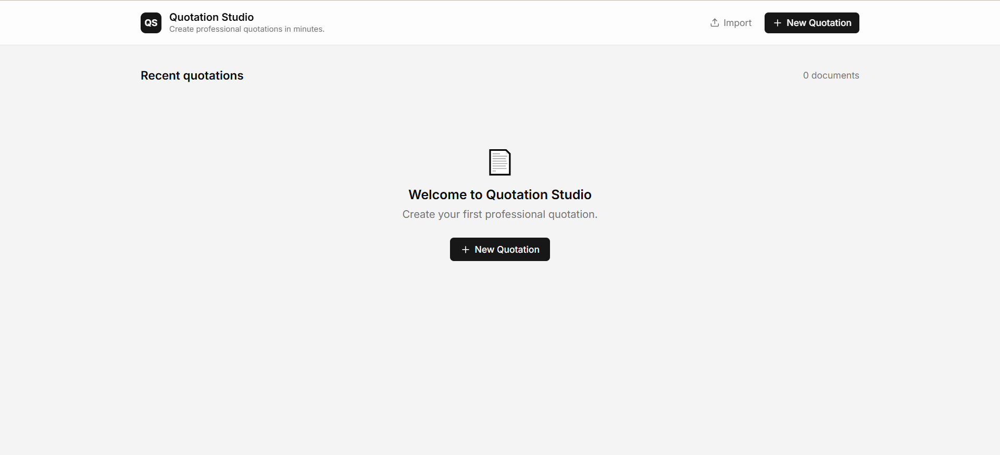

# 🧾 Quotation Generator

<p align="center">
  <strong>A modern web application for creating, editing, previewing, and managing professional quotations.</strong>
</p>

<p align="center">
  ⚡ Modern UI &nbsp;•&nbsp;
  📱 Responsive Design &nbsp;•&nbsp;
  🔐 Authentication &nbsp;•&nbsp;
  🧾 Quotation Management
</p>

<p align="center">
  <a href="YOUR_LIVE_APP_URL">
    
  </a>
</p>

---

## 📌 About The Project

**Quotation Generator** is a modern web application designed to simplify the
process of creating and managing professional quotations.

The application provides a clean and structured interface where users can
authenticate, access their dashboard, work with quotation information, and
preview the final quotation.

The project focuses on building a **responsive, reusable, and user-friendly
frontend experience** using React.js and modern web development practices.

---

## ✨ Key Features

- 🧾 **Quotation Management**
  - Create and manage quotation information
  - Structured quotation workflow
  - Organized quotation interface

- 📝 **Quotation Editor**
  - Edit quotation information
  - Structured form-based editing experience
  - Easy-to-use interface

- 👀 **Quotation Preview**
  - Preview quotation information
  - Dedicated preview page
  - Clean presentation of quotation details

- 📊 **Dashboard**
  - Centralized application dashboard
  - Organized navigation
  - Easy access to application functionality

- 🔐 **Authentication**
  - User login
  - User registration
  - Forgot password
  - Password reset
  - OAuth consent flow

- 🎨 **Modern UI**
  - Clean and professional interface
  - Reusable UI components
  - Consistent application design

- 📱 **Responsive Design**
  - Desktop support
  - Tablet support
  - Mobile-friendly layouts

- ⚡ **Interactive Experience**
  - Fast navigation
  - Dynamic application interface
  - Component-based architecture

---

## 🖥️ Application Preview

<p align="center">
  
</p>

> 📸 Add your application screenshot inside the `assets` folder and update
> the image filename above if required.

---

## 🔐 Authentication

The application includes a complete authentication flow.

### Available Authentication Pages

- 🔑 Login
- 📝 Register
- 🔒 Forgot Password
- 🔄 Reset Password
- 🛡️ OAuth Consent

---

## 📊 Dashboard

The dashboard acts as the central workspace of the application.

Users can access the main quotation functionality and navigate through the
different sections of the application from a centralized interface.

---

## 🧾 Quotation Editor

The quotation editor provides a structured interface for working with
quotation information.

### Main Capabilities

- ✏️ Edit quotation details
- 📝 Manage quotation information
- 📋 Organize quotation content
- 👀 Preview quotation output

---

## 👀 Quotation Preview

The preview page provides a dedicated view for checking the quotation before
using or sharing the final information.

```text
🧾 Quotation Data
       ↓
📝 Edit Quotation
       ↓
👀 Preview
       ↓
📄 Final Quotation

---

🗂️ Project Structure
📦 Quotation Generator
│
├── 📁 src
│   │
│   ├── 📁 api
│   │   └── 🔗 API functionality
│   │
│   ├── 📁 components
│   │   └── 🧩 Reusable UI components
│   │
│   ├── 📁 hooks
│   │   └── 🪝 Custom React hooks
│   │
│   ├── 📁 lib
│   │   └── ⚙️ Application utilities
│   │
│   ├── 📁 pages
│   │   ├── 📊 Dashboard.jsx
│   │   ├── 📝 Editor.jsx
│   │   ├── 🔒 ForgotPassword.jsx
│   │   ├── 🔑 Login.jsx
│   │   ├── 🛡️ OAuthConsent.jsx
│   │   ├── 👀 Preview.jsx
│   │   ├── 📝 Register.jsx
│   │   └── 🔄 ResetPassword.jsx
│   │
│   └── 📄 App.jsx
│
├── 📁 base44
│   └── ⚙️ config.jsonc
│
└── 📄 README.md
